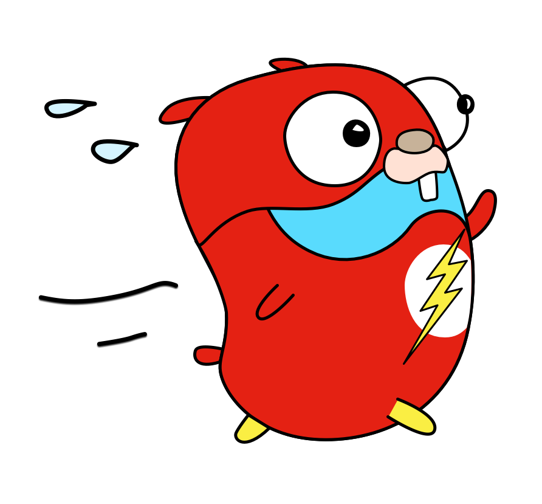

<h1 align="center">Kafka Go Example</h1>

<p align="center">
  
</p>

## Overview
Experimented kafka queue & event driven system with go

## Install packages
```
dep ensure
```

## Setup environment variables

Copy .env.example to .env and set env variables properly.

## Test examples

### Queue

Start consumer
```
$ go run cmd/queue/consumer/main.go
```

Kickoff producer
```
$ go run cmd/queue/producer/main.go
```

```
sent at -------------> provider/partition - 1/offset - 12172
.
.
.
sent at -------------> provider/partition - 1/offset - 12190
sent at -------------> provider/partition - 1/offset - 12191
sent at -------------> provider/partition - 0/offset - 11945
sent at -------------> provider/partition - 0/offset - 11946
```

### Event driven

Start listeners
```
$ go run cmd/event-driven/listener/confirmation/main.go
```
```
$ go run cmd/event-driven/listener/workflow/main.go
```

Kickoff event
```
$ go run cmd/event-driven/event/signup.go
```

## Author

**Joynal Abedin** - [Joynal](https://twitter.com/joynaluu)

## License

This project is licensed under the MIT License - see the [license](./license) file for details
